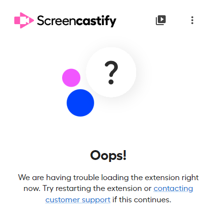

# OOP-Logo-Maker

## Demo

## Table of Contents
  
* [Install](#install)  
* [Description](#description)
* [Usage](#usage)
* [Contact](#contact)

## Install
Make sure all dependencies are installed before running
Run npm install inquirer@8.2.4
Run npm init
Run npm i Jest

## Description

I was motivated to create this project to better expand on how JEst can be properly used to test apps. I also created this to solidify my grasp on SVG and how the vector graphic creator can be used fluidly in applications to create logos shapes and much more content. 
## Usage

User will be prompted with several questions based on what shape, text , or color they would like their logo to be. 

## Contact
Email: chanevan13@gmail.com